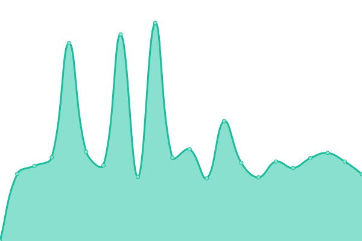
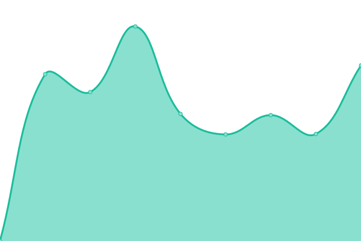
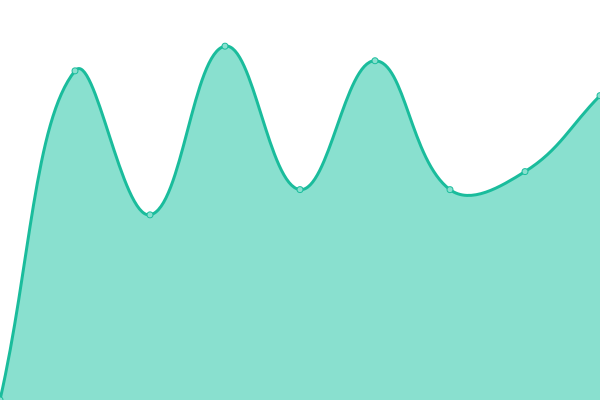
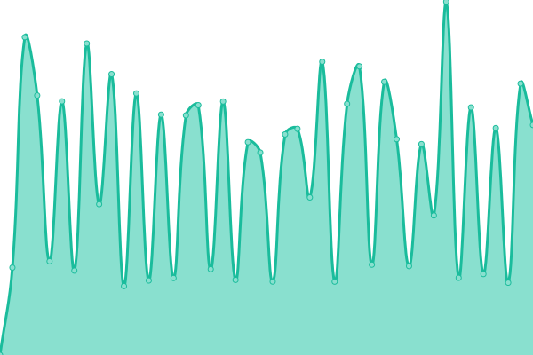

# [📈 Live Status](https://solo10010.github.io/upptime): <!--live status--> **🟩 All systems operational**

This repository contains the open-source uptime monitor and status page for [solo](https://solo10010.github.io/), powered by [Upptime](https://github.com/upptime/upptime).

With [Upptime](https://upptime.js.org), you can get your own unlimited and free uptime monitor and status page, powered entirely by a GitHub repository. We use [Issues](https://github.com/solo10010/upptime/issues) as incident reports, [Actions](https://github.com/solo10010/upptime/actions) as uptime monitors, and [Pages](https://solo10010.github.io/upptime) for the status page.

<!--start: status pages-->
<!-- This summary is generated by Upptime (https://github.com/upptime/upptime) -->
<!-- Do not edit this manually, your changes will be overwritten -->
<!-- prettier-ignore -->
| URL | Status | History | Response Time | Uptime |
| --- | ------ | ------- | ------------- | ------ |
|  [hoster](https://hoster.kz/) | 🟩 Up | [hoster.yml](https://github.com/solo10010/upptime/commits/HEAD/history/hoster.yml) | 

 1146ms
     
 | 

<a href="https://solo10010.github.io/upptime/history/hoster">100.00%</a>
    

|  [vkitae.kz](https://vkitae.kz/) | 🟩 Up | [vkitae-kz.yml](https://github.com/solo10010/upptime/commits/HEAD/history/vkitae-kz.yml) | 

 7700ms
     
 | 

<a href="https://solo10010.github.io/upptime/history/vkitae-kz">99.75%</a>
    

|  [hijama.kz_2192552](https://hijama.kz/) | 🟩 Up | [hijama-kz-2192552.yml](https://github.com/solo10010/upptime/commits/HEAD/history/hijama-kz-2192552.yml) | 

 2107ms
     
 | 

<a href="https://solo10010.github.io/upptime/history/hijama-kz-2192552">100.00%</a>
    

|  [abrcloud.amphibia.kz](https://abrcloud.amphibia.kz/) | 🟩 Up | [abrcloud-amphibia-kz.yml](https://github.com/solo10010/upptime/commits/HEAD/history/abrcloud-amphibia-kz.yml) | 

 1693ms
     
 | 

<a href="https://solo10010.github.io/upptime/history/abrcloud-amphibia-kz">98.54%</a>
    

|  [eler-plast.kz](https://eler-plast.kz/) | 🟩 Up | [eler-plast-kz.yml](https://github.com/solo10010/upptime/commits/HEAD/history/eler-plast-kz.yml) | 

 5873ms
     
 | 

<a href="https://solo10010.github.io/upptime/history/eler-plast-kz">88.10%</a>
    

|  [petsmart.kz](https://petsmart.kz/) | 🟩 Up | [petsmart-kz.yml](https://github.com/solo10010/upptime/commits/HEAD/history/petsmart-kz.yml) | 

 7886ms
     
 | 

<a href="https://solo10010.github.io/upptime/history/petsmart-kz">98.31%</a>
    

<!--end: status pages-->

[**Visit our status website →**](https://solo10010.github.io/upptime)

## 📄 License

- Powered by: [Upptime](https://github.com/upptime/upptime)
- Code: [MIT](./LICENSE) © [solo](https://solo10010.github.io/)
- Data in the `./history` directory: [Open Database License](https://opendatacommons.org/licenses/odbl/1-0/)
